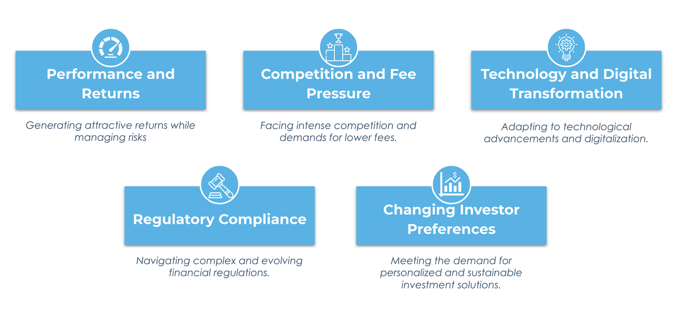
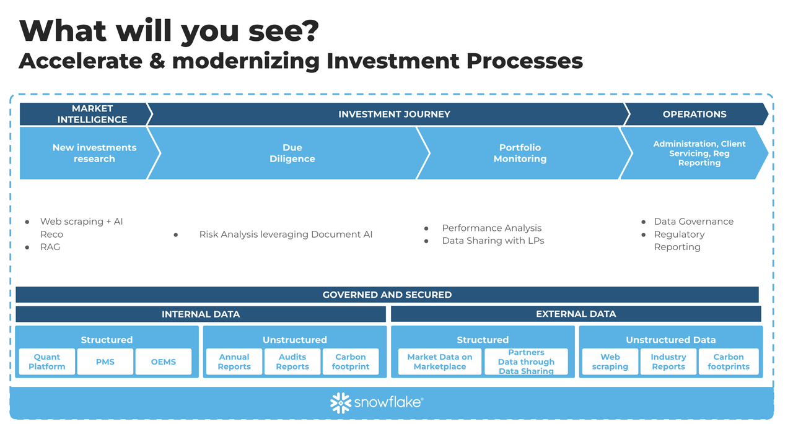

# README Guide

README aims to guide other SEs through the demo's purpose, structure, and the business context it aims to simulate, emphasizing its relevance and application to real-world asset management scenarios.

_**This demo was created in March 2024** with features GA or in Private Preview at the time. It can be enhanced to benefit from future features as soon as they become available._

---

## 🚀 Investment Insight Accelerator

**Join us on a journey through the Investment Insight Accelerator** — 100% Streamlit in Snow, this demo is designed with the asset management industry in mind, providing a glimpse into the kind of challenges and solutions that come with the changing times of 2024.

### 📚 Table of Contents 
- [Repository Contents](#repository-contents)
- [Prerequisites](#prerequisites)
- [Setup](#setup)
- [Demo Context](#demo-context)
- [Contribution & Support](#contribution--support)

##  🎁 Repository Contents

- **`00_Inputs`**: Essential assets such as CSVs and documents necessary for deploying the demo.
- **`01_demo_config`**: SQL scripts and configuration files for setting up the Snowflake environment.
- **`02_streamlit`**: Streamlit application code for interactive demonstrations. Demo has been built for scenario-driven walkthroughs, tab by tab, or to underscore specific aspects of the investment process. It serves as a dynamic tool for real-time analytics and portfolio monitoring, designed for both comprehensive overviews and deep dives on particular stages of asset management.

## Prerequisites

- **Deployment**: For the latest features in Private Preview, use AWS US East (N. Virginia) or AWS US West (Oregon) regions.
- **Document AI**: Ensure Document AI is enabled on your account and proper privileges are granted as detailed in the [Document AI introduction](https://docs.snowflake.com/LIMITEDACCESS/document-ai/introduction).
- **Cortex Functions**: Verify access to Cortex functions and confirm privileges are set for the demo role according to [Cortex documentation](https://docs.snowflake.com/user-guide/snowflake-cortex/llm-functions).

## Setup

1. **Clone**: Obtain all the necessary tools in one location.
2. **Run `demo_setup.sql`**: Configure your Snowflake instance by uploading files from the `Inputs` directory into your designated stage as instructed in the script.
3. **Execute `doc_setup.sql`**: If you have an external stage named `DUE_DILLIGENCE` set up, complement it with an internal stage to facilitate the Streamlit application display.

## Demo Context

**Welcome to the Investment Insight Accelerator** — In 2024, the asset management world faces new challenges. This Snowflake-powered demo engages SEs in deep discussions, leveraging innovative solutions to meet the industry's needs.

### Scenario Overview

Dive into detailed scenarios reflecting the asset management life cycle:

- **Market Intelligence**: Utilize Document AI to conduct extensive market analysis and uncover trends like **SkiGear Co.**'s advancements in outdoor gear textiles.
- **Due Diligence**: Employ Cortex for comprehensive reviews and risk assessments to inform investment decisions with precision.
- **Post-Investment Strategy and Governance**: Use Document AI for ongoing portfolio monitoring and governance to ensure adherence to compliance and performance optimization.

## Contribution & Support

For feedback or assistance with this demo, please contact demo builder, Antoine Lentschener, at [antoine.lentschener@snowflake.com](mailto:antoine.lentschener@snowflake.com).

