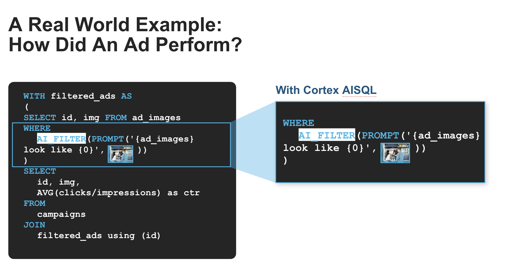

# Ad Campaign Image Analytics with Snowflake Cortex

## Overview
This solution demonstrates how to leverage Snowflake's AISQL capabilities to analyze ad campaign images and impression data. Through this notebook, you'll learn how to use AI-powered functions to extract insights, classify ad content, generate taglines, and aggregate customer feedback—all using familiar SQL syntax.

By expressing everything in SQL, this approach uniquely bridges structured and unstructured data analysis. It enables seamless integration of multiple data modalities, allowing marketers to analyze images alongside traditional metrics in a single, unified workflow without switching between specialized tools or platforms.

## Key Features
- Image-based ad classification by type (lifestyle, product shot, promo offer, etc.)
- Intelligent filtering of images based on content criteria
- AI-powered tagline generation for ad campaigns
- Sentiment analysis and feedback aggregation from customer reviews
- SQL-native workflow for unstructured data analysis

## Business Value

1. Enhanced Ad Campaign Optimization
2. Data-Driven Marketing Decisions
3. Operational Efficiency
4. Improved Campaign Performance

## Technical Components
The solution leverages several Snowflake Cortex AI-SQL functions:

- **FILE Data Type**: Process image files directly in Snowflake
- **AI_COMPLETE**: Generate creative taglines based on image content
- **AI_FILTER**: Identify images containing specific elements (e.g., coffee makers)
- **AI_CLASSIFY**: Categorize ads into predefined types
- **AI_AGG**: Aggregate and analyze customer feedback across ad categories

## Example Use Cases
1. **Ad Content Classification**: Automatically categorize ad images by type
2. **Content-Based Filtering**: Select images containing specific high-converting elements
3. **Tagline Generation**: Create compelling ad copy aligned with visual content
4. **Sentiment Analysis**: Measure customer response across different ad types
5. **Campaign Performance**: Identify which image types and content elements drive engagement

## Usage
See `ads_analytics.ipynb` for a step-by-step demonstration of how to implement ad image analytics within Snowflake, using Cortex AI-SQL functions for intelligent analysis.
