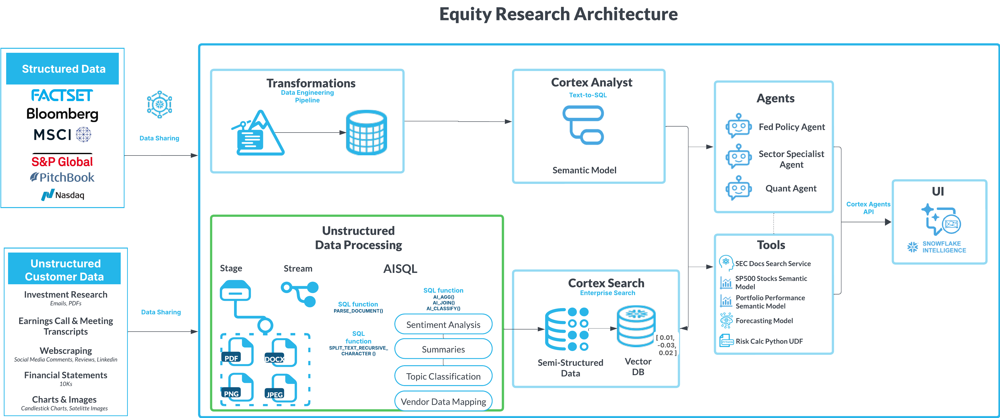

# AI-Powered Equity Research Analytics with Snowflake Cortex

## Overview
This solution demonstrates how to leverage Snowflake's AI-SQL capabilities to process and analyze unstructured financial research documents. By combining AI functions with traditional SQL operations, this notebook creates a streamlined workflow for extracting actionable insights from equity research reports—enabling more efficient financial analysis and investment decision support.

You can leverage different part of Snowflake Cortex feature to build your workflow. For this notebook specifically, we focus on leveraging AISQL to supercharge the unstructured data processing part.

## Key Features
- Automated PDF research report processing
- Entity extraction with sentiment analysis
- Company name disambiguation and ticker mapping
- Cross-document insight aggregation by ticker
- Research summarization with contextual understanding

## Technical Components
The solution leverages several Snowflake Cortex AI-SQL functions:

- **PARSE_DOCUMENT**: Extract text content from PDF research reports
- **AI_COMPLETE with Structured Output**: Extract company entities and sentiment in structured format
- **AI_SIMILARITY**: Find potential ticker matches based on semantic similarity
- **AI_FILTER**: Disambiguate company names for accurate ticker mapping
- **AI_AGG**: Aggregate insights across multiple research documents by ticker

## Example Use Cases
1. **Investment Research**: Consolidate insights on specific companies from multiple sources
2. **Competitive Analysis**: Extract mentions and sentiment about competitors
3. **Market Intelligence**: Identify trending companies and sentiment across research reports
4. **Insights Summary**: Aggregate research insights about companies in a portfolio

## Implementation Steps
The notebook demonstrates a complete pipeline:
1. Parse PDF research documents into text using PARSE_DOCUMENT
2. Extract company mentions and sentiment using structured output
3. Map extracted companies to S&P 500 tickers using similarity and AI_FILTER
4. Aggregate insights across multiple documents for specific tickers

## Usage
See `data_processing_equity_research.ipynb` for a step-by-step demonstration of how to implement this equity research processing pipeline within Snowflake, using Cortex AI-SQL functions for intelligent analysis.

## Prerequisites
- S&P 500 ticker data (available from Snowflake Marketplace)
- Equity research PDFs stored in a Snowflake stage