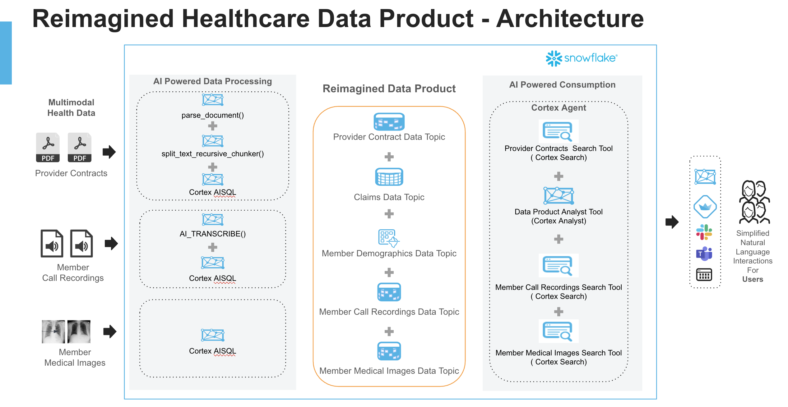

# Multimodal Healthcare Analytics with Snowflake AISQL

## Overview
This solution demonstrates how to leverage Snowflake's AISQL capabilities to analyze multimodal healthcare data, including medical images, PDFs, and audio files. The notebook showcases a comprehensive approach to processing various healthcare data types using AI-powered SQL functions, enabling healthcare organizations to derive meaningful insights from diverse clinical data sources.

For this example, we primarily focused on AI powered data processing to get all your multimodal data "AI ready".

## Key Features
- Medical image classification and filtering
- PDF document processing and analysis of medical transcripts
- Audio transcription and classification of healthcare calls
- Population health insights generation from unstructured text
- Streamlined data processing workflows with SQL-native AI functions

## Technical Components
The solution leverages several Snowflake Cortex AI-SQL functions:

- **FILE Data Type**: Process images, PDFs, and audio files directly in Snowflake
- **AI_FILTER**: Identify records matching specific criteria
- **AI_COMPLETE**: Generate insights and classifications from multimodal data
- **AI_CLASSIFY**: Categorize healthcare data into predefined classes
- **AI_TRANSCRIBE (PrPr)**: Convert audio recordings to text for analysis
- **AI_AGG**: Aggregate insights across multiple medical records
- **PARSE_DOCUMENT**: Extract text content from PDFs and other documents

## Example Use Cases
1. **Medical Image Routing**: Automatically identify and route images to appropriate specialists
2. **Call Center Optimization**: Classify patient calls to direct them to the right department
3. **Population Health Insights**: Generate aggregated health insights for physician intervention
4. **Accident Identification**: Filter medical records for specific health events
5. **Clinical Documentation Analysis**: Extract structured data from unstructured medical notes

## Usage
See `multimodal_analytics_healthcare.ipynb` for a comprehensive demonstration of multimodal healthcare analytics within Snowflake, using Cortex AI-SQL functions for intelligent data processing.
