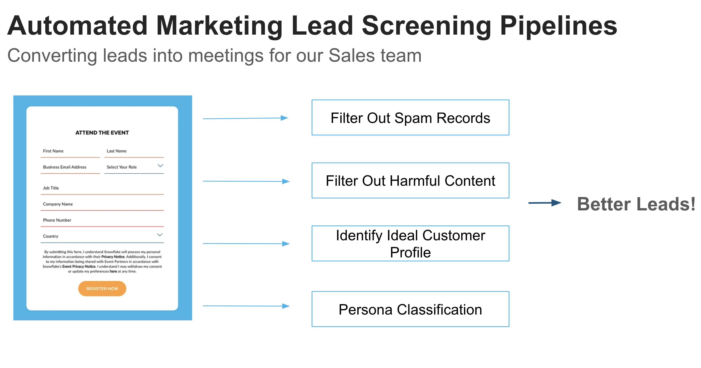

# AI-Powered Marketing Lead Screening Pipeline

## Overview
This solution demonstrates how to leverage Snowflake's Cortex AISQL capabilities to automate and enhance the marketing lead qualification process. By intelligently screening and enriching web form submissions, this pipeline helps marketing and sales teams focus their efforts on the highest-potential prospects.

## Key Features
- Spam and harmful content filtering
- ICP-based lead scoring ("High", "Medium", "Low", "Poor")
- Seniority-based classification (CXO, VP+, Director, Manager, IC)
- AI-powered personalized email draft generation
- Integration with company information for enriched insights

## Business Value

1. Improved Lead Quality
2. Increased Operational Efficiency
3. Enhanced Sales Effectiveness
4. Scalable Lead Management
5. Better ROI

## Usage
See `marketing_lead_pipeline.ipynb` as a pipeline example to be implemented as part of your marketing automation workflow in Snowflake, leveraging Cortex AISQL for intelligent lead processing and qualification.

