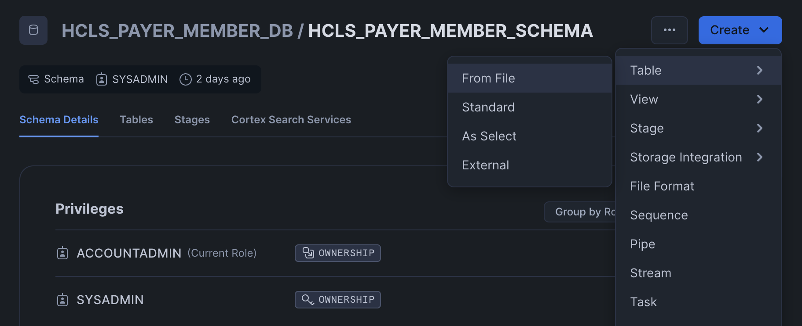
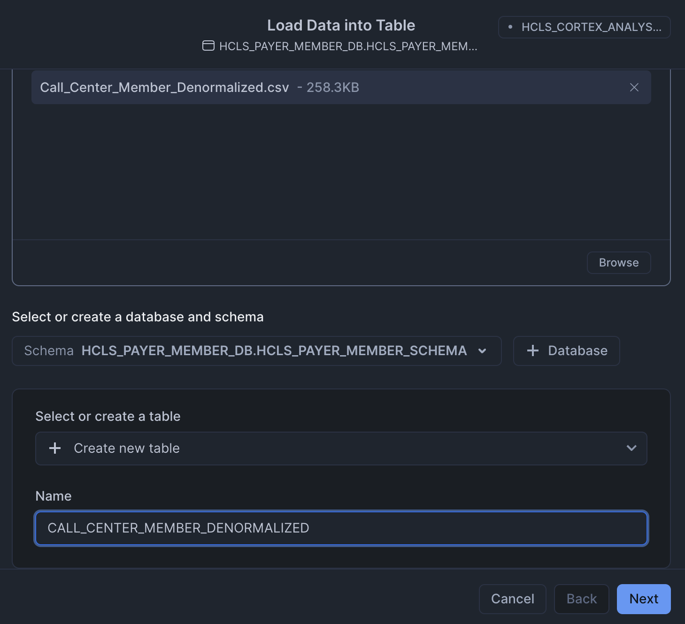
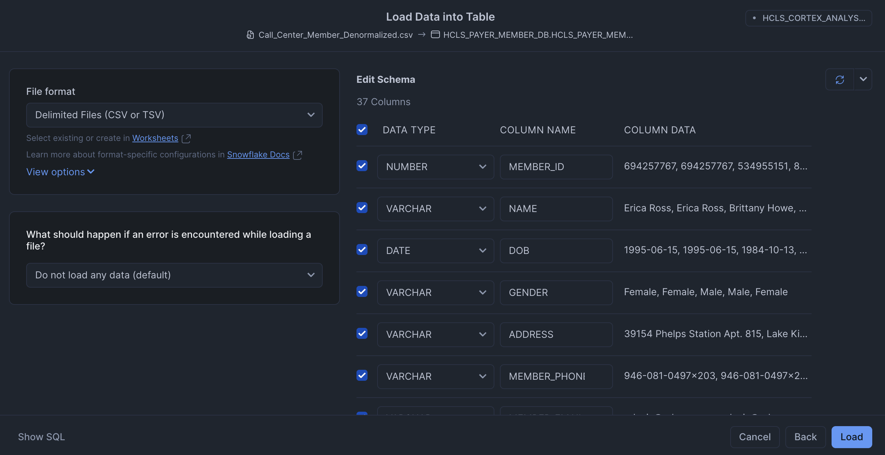
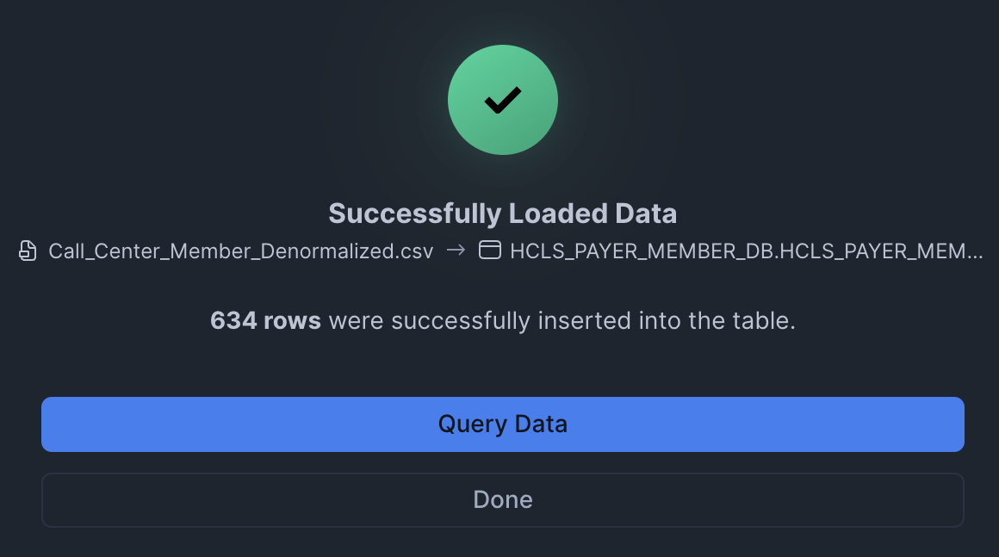
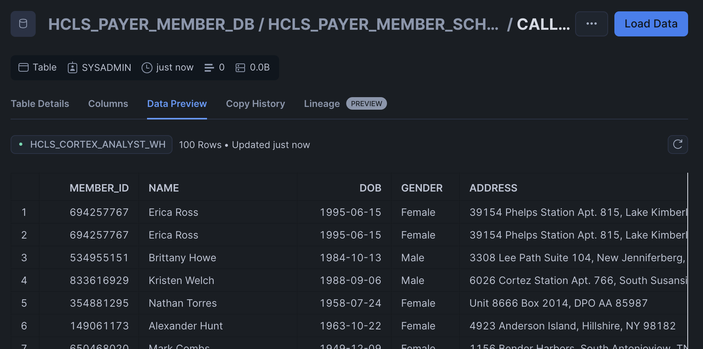

# Healthcare Insurance Member 360 Data Setup for Cortex Analyst

You are the Business Leader for a Payer/Health Plan’s Call Center operations. There are 4 primary caller personas reaching your Call Center - Member, Provider, Employer and Broker. Based on a detailed study you have identified that Call Center Agents are currently struggling with timely and simplified access to relevant personalized information, and this is degrading the related caller experience.

## Data Setup
This example is from the perspective of the `Member` caller persona, and we have caller specific data e.g. Member 360 data for Members in this scenario.

:exclamation::exclamation: **Make sure to switch to `SYSADMIN` for the rest of these steps!** :exclamation::exclamation:

### Create Snowflake objects
Copy & paste the following in a sql worksheet and run all:

```sql
USE ROLE SYSADMIN;

-- Assign Query Tag to Session. This helps with performance monitoring and troubleshooting.
ALTER SESSION SET query_tag = '{"origin":"sf_sit-is","name":"hcls_payer_cortex_analyst","version":{"major":1, "minor":0},"attributes":{"is_quickstart":0, "source":"sql"}}';

-- Create a new database, schema, and stage
CREATE OR REPLACE WAREHOUSE HCLS_CORTEX_ANALYST_WH;
CREATE OR REPLACE DATABASE HCLS_PAYER_MEMBER_DB;
CREATE OR REPLACE SCHEMA HCLS_PAYER_MEMBER_SCHEMA;
CREATE OR REPLACE STAGE HCLS_PAYER_MEMBER_STAGE;
```

### Upload data

1. Upload the `Call_Center_Member_Denormalized.csv` file into a Snowflake table by following the steps shown here:









2. Check to make sure the data was loaded.



## Cortex Analyst Setup
Use the [Getting Started with Cortex Analyst](https://quickstarts.snowflake.com/guide/getting_started_with_cortex_analyst/index.html#0) QuickStart guide to setup the demo but swap the semantic model and data objects to the ones provided here.

Within the streamlit application python file, make sure to update to the following:
```
DATABASE = "HCLS_PAYER_MEMBER_DB"
SCHEMA = "HCLS_PAYER_MEMBER_SCHEMA"
STAGE = "HCLS_PAYER_MEMBER_STAGE"
FILE = "HCLS_Payer_Call_Center_Member_Denormalized.yaml"
```

## Sample questions to ask

**Generic:**
- How many members are there?
- What is the most popular plan?

**Member related:**
- Give me more details related to the claim submitted on April 14, 2024 by Tracy Smith.
- Does Tracy Smith have any underlying issues?
- How many claims does Tracy Smith have?
- What is Tracy Smith's total claim amount?
- What is Tracy Smith's most recent plan type?