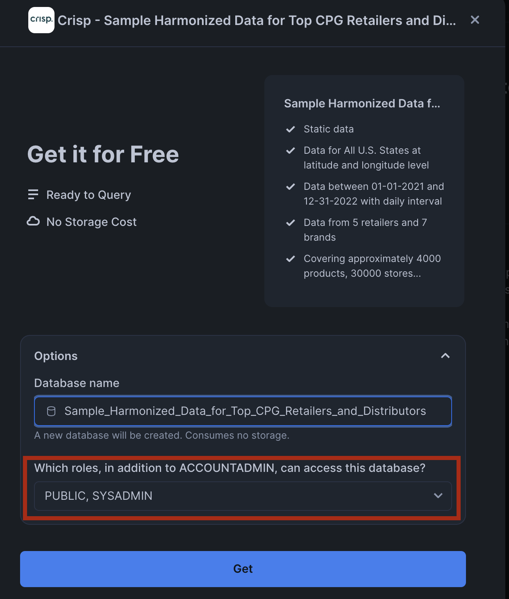
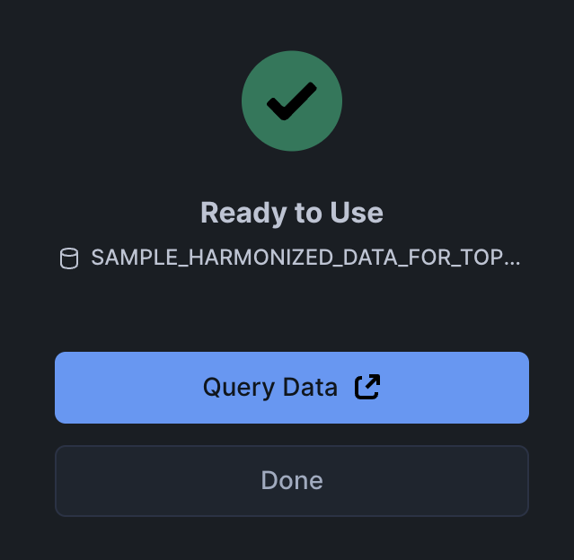
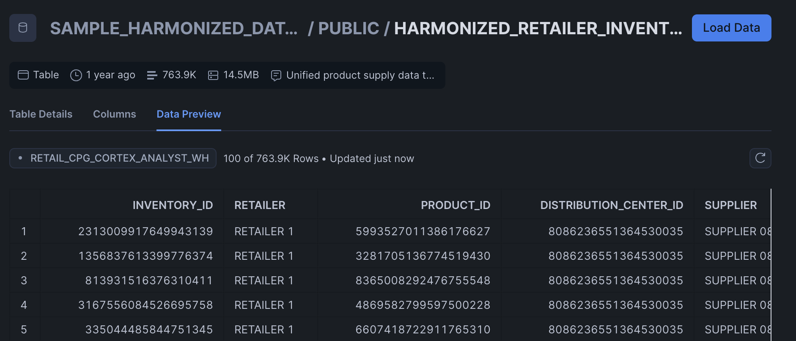

# Retail & CPG Inventory Planning Data Setup for Cortex Analyst

## Data Setup
This example uses the CRISP dataset from Snowflake Marketplace that is centered around inventory and demand planning use cases.

Specifically, the Distribution Center Inventory data is used here.

### Create Snowflake objects
Copy & paste the following in a sql worksheet and run all:

```sql
USE ROLE SYSADMIN;

-- Assign Query Tag to Session. This helps with performance monitoring and troubleshooting.
ALTER SESSION SET query_tag = '{"origin":"sf_sit-is","name":"retail_cpg_inventory_cortex_analyst","version":{"major":1, "minor":0},"attributes":{"is_quickstart":0, "source":"sql"}}';

-- Create a new warehouse, database, schema, and stage
CREATE OR REPLACE WAREHOUSE RETAIL_CPG_CORTEX_ANALYST_WH;
CREATE OR REPLACE DATABASE RETAIL_CPG_INVENTORY_DB;
CREATE OR REPLACE SCHEMA RETAIL_CPG_INVENTORY_SCHEMA;
CREATE OR REPLACE STAGE RETAIL_CPG_INVENTORY_STAGE;
```

### Get data on Snowflake Marketplace
:exclamation: Make sure to switch to `SYSADMIN` for the rest of these steps! :exclamation:
#### Steps to access CRISP data on Snowflake Marketplace:

1. Search for `CRISP` in Snowflake Marketplace.


2. Select `Get`


3. Add roles `SYSADMIN` and `PUBLIC`


4. It should be `Ready to Use`


5. Check to see if the tables were populated.


## Cortex Analyst Setup
Use the [Getting Started with Cortex Analyst](https://quickstarts.snowflake.com/guide/getting_started_with_cortex_analyst/index.html#0) QuickStart guide to setup the demo but swap the semantic model and data objects to the ones provided here.

Within the streamlit application python file, make sure to update to the following:
```
DATABASE = "RETAIL_CPG_INVENTORY_DB"
SCHEMA = "RETAIL_CPG_INVENTORY_SCHEMA"
STAGE = "RETAIL_CPG_INVENTORY_STAGE"
FILE = "Harmonized_Retailer_Inventory_DC.yaml"
```

## Sample questions to ask
- How much is there in stock for each product for RETAILER 1?
- Which distribution center has the least amount of product stock for RETAILER 1?
- What is my on hand inventory count by geography for RETAILER 1?
- Which distribution center and state has the lowest stock in the East Coast for RETAILER 1?
- Which distribution center and state has the highest stock in the East Coast for RETAILER 1?
