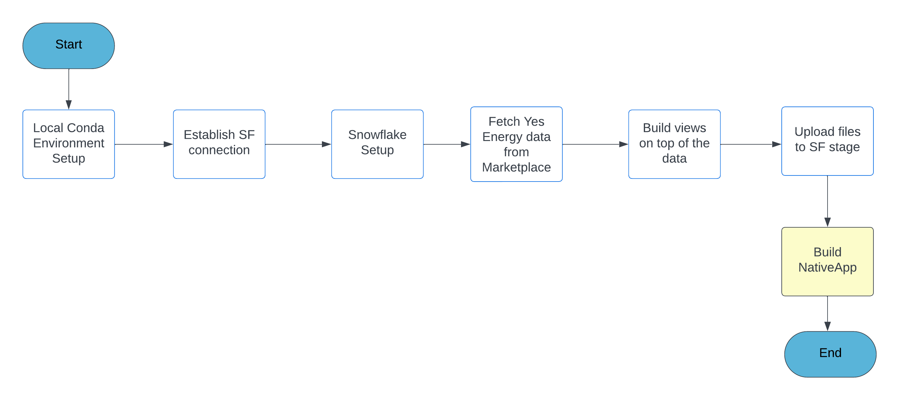
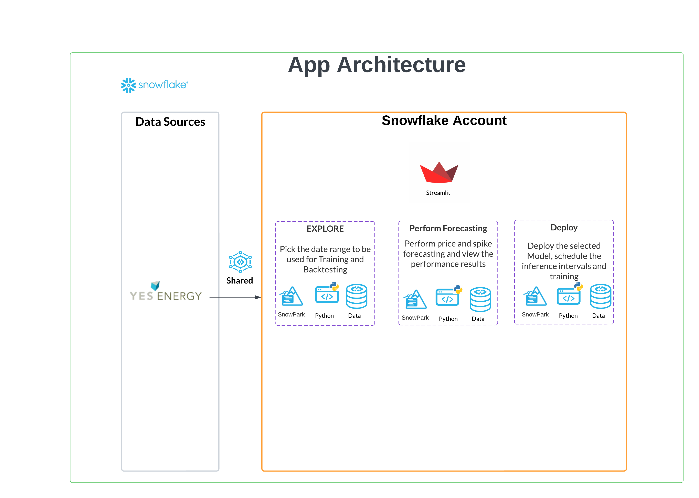
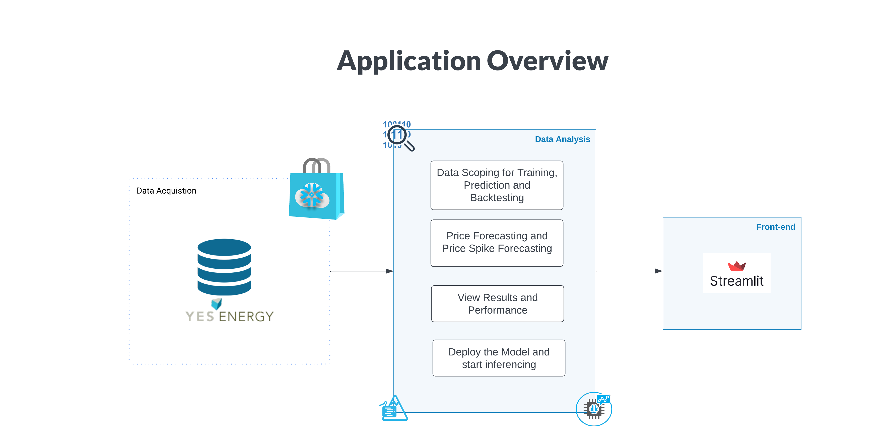

- # Energy Spike Forecasting
    ## Introduction
    This demo shows how to set up a recurring forecast for day-ahead hourly electricity prices at a trading point in Texas (ERCOT North Hub). 

    Most electricity is sold in wholesale electricity markets. Power plant operators sell power from their generators while utilities or retail energy providers buy power to cover their load obligations. Often, these companies have dedicated trading, supply, or portfolio management teams responsible for the buying and selling of electricity. 

    Since the price of electricity can be highly volatile — fluctuating as much as 1,000x between different times in a single day — buying or selling electricity can drive very large gains or losses. To minimize risk and maximize profits, companies need accurate short-term forecasts of volumes (either supply or demand) as well as market prices. These short-term forecasts are then used by traders or portfolio managers to inform buying and selling decisions. 

    While this demo focuses explicitly on electricity price forecasting, it can be modified to focus on forecasting price for other commodities (e.g. oil and natural gas). 

- ### Who is this for?:
    This demo shows how to develop and deploy an AI/ML time series forecasting model using Snowflake. 

    It was developed for data scientists who can use the code in the Jupyter Notebooks and use it as a starting point to develop and deploy their own forecasting models. 

    In addition, this demo includes a Native App. This can be used by business users to re-run the forecasting models built by data science teams. 

- ### What’s included in this demo?

    - **Jupyter Notebooks**: This is the primary interface for data scientists. The first notebook (“...”) focuses on forecasting electricity price (in $/MWh). The second notebook (“...”) focuses on forecasting the likelihood that electricity prices spike. 

    - **Native Application**: Native Apps are a mechanism to distribute front-end applications directly through Snowflake. We’ve developed a Native App to show how this model might be deployed to business users. 

    - **Demo script**: The demo script shows internal Snowflake Solutions Engineers how to present this to an electricity company.

    - **Demo recording**: This shows a recording of the demo. It starts with an introduction of the Jupyter Notebook, and covers the Native Application afterwards. 

- ### What are the steps in the demo?
    This demo — both the Jupyter Notebooks and the Native App — go through the following steps. 

- #### Model development
    - **Data collection**. Data is collected for the target (historical day-ahead prices for ERCOT North) and for relevant features (such as system-wide load forecasts and solar production forecasts). These data come via a free data sample from data provider Yes Energy, available through Snowflake Marketplace. This means that no ELT is needed. 
    - **Data processing**. Then, we clean the data so that it can be used in the model experimentation. This includes seeing if there are anomalies in the data and formatting the column titles. 
    - **Feature engineering**. Then, features must be constructed. We created a feature for Real Time Market (RTM) System Lambda prices from yesterday by doing a 24 hour shift on our Real Time Market (RTM) System Lambda prices from today. 
    - **Hyperparameter optimization**. We use two open source packages (Optuna and CMAES) to optimize the hyperparameters of the model. 
    - **Experimentation using backtesting**. We then backtest the model. We train the model on data from early 2017 to 2020 and make predictions on the first week of 2021. Then we retrain the model on the previous training data + the first week we made predictions on and predict upon the second week and continue retraining the model weekly to make our next batch of weekly predictions.
    - **Evaluating performance**. Finally, we visualize performance of the model, using both mean squared error (MSE) and mean absolute error (MAE). We find that the model performs significantly better than a persistence forecast. 

- #### Model deployment
    - **Scheduling model** inference or scoring. Finally, we included a method to produce a new forecast (i.e. run inference or scoring) from a trained model on a schedule. We do this by using a User Defined Function (UDF) to call the model from Snowflake’s ML staging area and perform inference on new data that enters Snowflake’s database. 

- ### How Does it work?
- #### Process Flow

- ### The App Architecture

- ### The Overview

- ### What Does this Demo contain?
    - How to dynamically parse JSON and validate DQ rules on them using Snowflake Snowpark
    - How to easily mask consent data by roles dynamically using Snowflake column masking
    - How to create Native App
    - How the consented data can be shared with 3rd party vendor and apply row level masking policy per vendor by building a Native App
    - How the NativeApp can be leveraged for Consent Management with telemetry feedback used to capture Delete Consent Acknowledgement

- ### Features leveraged within Snowflake as part of this Demo
    - Marketplace
    - Data Science - Timeseries Forecasting
    - Snowpark for Python
    - Streamlit
    
- ### End to End 
  - Step by step installation is available in [Setup notebook](./Setup_Energy_Price_Forecasting.ipynb). Please follow the instructions and at the end, NativeApp gets deployed in your snowflake account.

- ### Limitations
    - N/A
 
