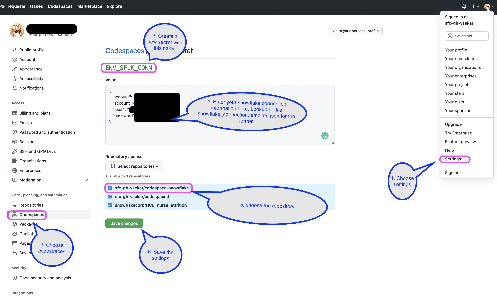
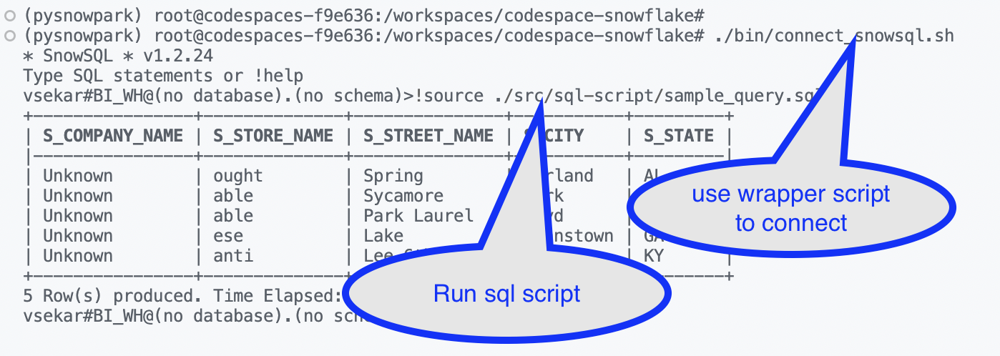
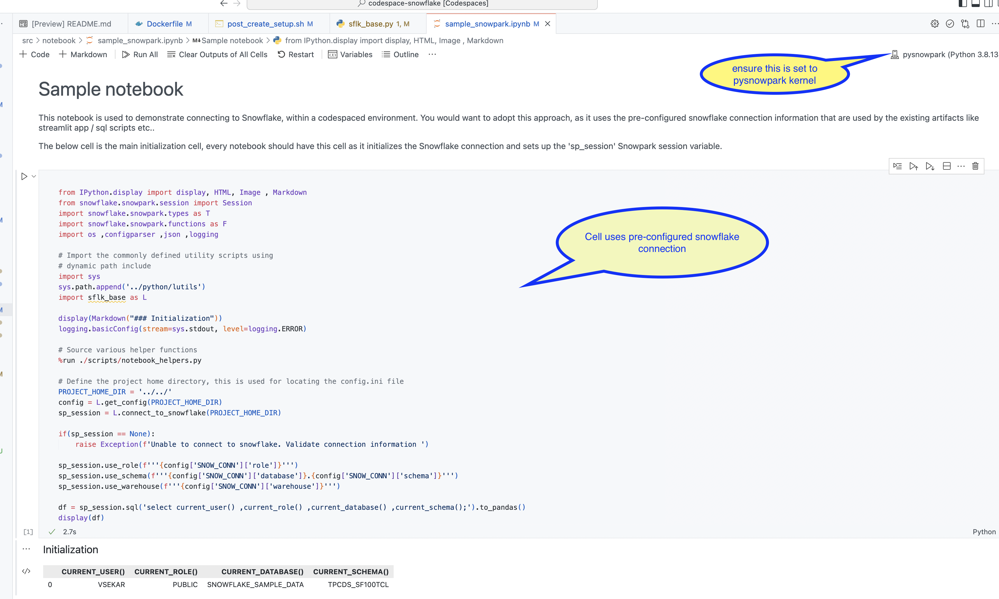
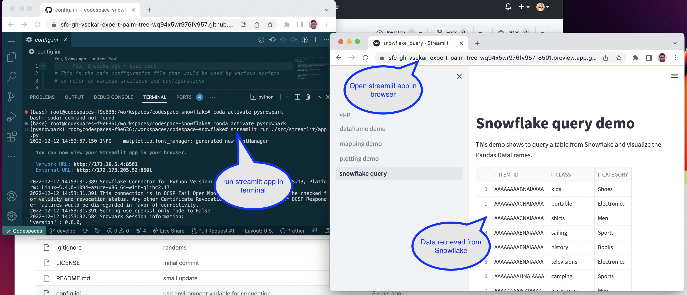
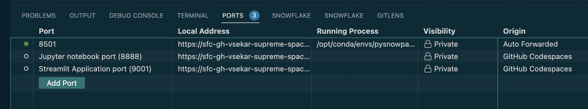

# Running Codespace

This doc lays out the steps for running an instance of the "codespaced" project. In this case; we are trying to walk-thru various examples based of the current template. We will showcase

- Configure secrets
- Instantiating a codespace instance
- Executing a snowsql script
- Executing a notebook
- Executing a streamlit app


<details>
  <summary> <H3>Configuring Snowflake connection (click to expand) </H3> </summary>

For a given project, at a minimum you would need to store and access secrets to connect to Snowflake. Typically we have these stored in a configuration file that follows a template; for ex: [snowflake_connection.template.json](../snowflake_connection.template.json) and then later referring to read it. We also need a facility to store these in a way that does not get into the repo. 

Github Codespace facilitates storing and accessing secrets via environment variables. The method to do this is explained in [Doc: Managing encrypted secrets for your codespaces](https://docs.github.com/en/codespaces/managing-your-codespaces/managing-encrypted-secrets-for-your-codespaces)

Given the possibility that we could run this project locally and also in a docker environment, we need to determine this during run-time. When running in a codespace dockerized environment, we purposefully inject a dummy file '<project home dir>/.is_codespace_env.txt', to indicate that we are running in a docker. We can use this to choose to read the local configuration secrets file or the environment variable accordingly.

### If running in Codespace

In the file [config.ini](../config.ini), set the configuration variable 'connection_info' has been configured to
read the connection information either to read from a local file (sflk_connection.json) or to refer to a Github Codespace secret (ENV_SFLK_CONN).

Refer to [Doc: Managing encrypted secrets for your codespaces](https://docs.github.com/en/codespaces/managing-your-codespaces/managing-encrypted-secrets-for-your-codespaces), to create a secret with 
the same name as above configured variable name:


The content will need to be same structure as defined in the template [snowflake_connection.template.json](../snowflake_connection.template.json). Once when the codespace instance is instantiated; the secrets will be available in the environment variable




### If running local
May be you are not running in a codespace environment. Then you can use this option. Create a local file 'sflk_connection.json' ; having the same format as defined in the template [snowflake_connection.template.json](../snowflake_connection.template.json).


Also for safety purpose update the [.gitignore](../.gitignore) file accordingly, so that the file does not get checked into the repo. For convienience the .gitignore is pre-configured with "sflk_connection.json".
</details>

### Instantiating a codespace instance
Once the variable "SNOW_CONN.connection_info", we can instantiate an instance as follows

- on the repo, find the "Code" button and click on the "Create Codespace on <branch>" button.
   

It will take some time, may be 2-3 min on initial run to create an instance of Codespace. Once instantiated you will be presented with
the pre-configured VSCode, along with the artifacts from the repo.


#### Caveates & Notes:
 - Always do a fetch & pull once the instance is instantiated to have the necessary project artifacts reflect the latest from the repository. If you do not perform this, then the instance would only have those code that was defined.

 - To speed up the instance creation/startup time; it would be ideal to have a "Pre-Build" done. Refer to this [Doc: Prebuilding your codespaces](https://docs.github.com/en/codespaces/prebuilding-your-codespaces), on how to perform this.
  
 - Understand that the codespace could get deleted; hence ensure that you commit your changes to your branch for any unforseen circumstances. 

<details>
  <summary> <H3>Executing (click to expand) </H3> </summary>

### Snowsql Scripts
The environment is pre-configured with Snowsql, the Snowsql can be executed using a wrapper script [connect_snowsql.sh](../bin/connect_snowsql.sh). This script, looksup at the configuration variable "SNOW_CONN.connection_info" and sets the connection up accordingly. 

Once invoked using a terminal, you will see that the Snowflake instance is connected, you could run a script via the '!source' command:
```sql
!source src/sql-script/sample_query.sql
```


### Executing a notebook (inside VS Code)
A sample notebook has been pre-defined, which when adopted; can connect to Snowflake based on the configuration variable "SNOW_CONN.connection_info". Refer to sample [sample_snowpark.ipynb](../src/notebook/sample_snowpark.ipynb)



### Executing a streamlit app
A sample streamlit has been created, to demonstrate the ability to run streamlit via the Codespace. You start of by instantiating
the app using a terminal

```sh
conda activate pysnowpark
streamlit run ./src/streamlit/app.py
```
You can visit the port tab, and by clicking on the label 'Streamlit Application port', you could open the app in a browser.



NOTE: 
- Give about 2-3 minutes after the instance is instantiated initially. There are still background jobs that are getting defined in the Codespace instance, even though the IDE seems to be ready.
  
- In some cases; you would need to mark the port as "public", via the "port tab". [Doc: Sharing a port](https://docs.github.com/en/codespaces/developing-in-codespaces/forwarding-ports-in-your-codespace#sharing-a-port). We couldn't pre-configure this as currently
the functionality does not exist today



</detail>