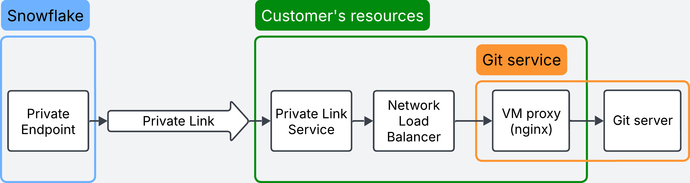

# On-premise Git server setup

In this setup the Git server is located outside of the cloud provider, so the traffic that goes from Snowflake to the Private Link Service needs to be redirected to this server.<br>
The main idea is to use proxy (nginx) that will redirect all HTTPS (port 443) traffic to the Git server.<br>
This setup will create all needed components on the customer's side.



After running this config, customer should set up VM as a proxy service (e.g. using nginx):
* Install docker on the VM
* Run docker as a service
* Prepare the `nginx.conf` file (replace `git_address.com` with your git server domain):
```
events {
}
stream {
    upstream git_server {
        server git_address.com:443;
    }
    server {
        listen 443;
        proxy_pass git_server;
    }
}
```
* Run following command: 
```
sudo docker run --rm -d --name my-custom-nginx-container -v $(pwd)/nginx.conf:/etc/nginx/nginx.conf:ro -p 443:443 nginx
```
* Test if your proxy works:
```
openssl s_client -connect localhost:443 -servername git_address.com
```
