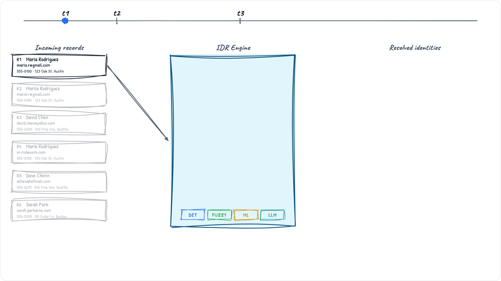

# Identity Resolution on Snowflake — Solution Accelerator

A solution accelerator for building AI-powered identity resolution (IDR) on Snowflake. It combines deterministic matching, ML scoring, and LLM-based adjudication to resolve fragmented customer records across multiple source systems into unified golden profiles — all running natively on Snowflake.

This repo provides a working reference implementation you can clone, deploy, and customize to jumpstart your own identity resolution pipeline.



---

## Architecture

```
┌─────────────────────────────────────────────────────────────────────────────┐
│                         BRONZE (4 Source Systems)                            │
│                                                                             │
│   POS_TRANSACTION    LOYALTY_MEMBER    WEB_CLICKSTREAM    SHOPIFY_ORDER     │
│         │                  │                  │                 │            │
│         └──────────────────┴──────────────────┴─────────────────┘            │
│                                    │                                         │
│                          APPEND_ONLY Streams                                 │
└────────────────────────────────────┬────────────────────────────────────────┘
                                     │
                                     ▼
┌─────────────────────────────────────────────────────────────────────────────┐
│  IDR_INCREMENTAL_TASK (Snowflake Task — scheduled or on-demand)             │
│                                                                             │
│  ┌───────────────┐  ┌──────────────────┐  ┌─────────────┐  ┌────────────┐  │
│  │ Standardize   │→ │ Extract          │→ │ Match       │→ │ Update     │  │
│  │ (normalize,   │  │ Identifiers      │  │ (17 rules)  │  │ Clusters   │  │
│  │  canonicalize) │  │ (EMAIL, PHONE,   │  │             │  │ (union-find│  │
│  │               │  │  LOYALTY#, etc.) │  │             │  │  connected │  │
│  │               │  │                  │  │             │  │  components│  │
│  └───────────────┘  └──────────────────┘  └─────────────┘  └────────────┘  │
└────────────────────────────────────┬────────────────────────────────────────┘
                                     │
                                     ▼
┌─────────────────────────────────────────────────────────────────────────────┐
│  GOLD — DT_CUSTOMER_PROFILE (Dynamic Table, TARGET_LAG = 1 min)             │
│                                                                             │
│  Unified golden record per cluster: best email, phone, name, address,       │
│  loyalty tier, lifetime value, source lineage                               │
└─────────────────────────────────────────────────────────────────────────────┘
```

### Key Design Principles

- **Incremental by default** — streams capture CDC; only new/changed records flow through the pipeline
- **Config-driven** — matching rules, source priority, and LLM prompts are table-driven, not hard-coded
- **Database-portable** — no procedure hard-codes the database name; deploy to any DB with `--db`
- **AI-augmented** — ML scores borderline pairs; LLM adjudicates the hardest cases with human-readable reasoning

### Matching Rules (17 total)

| Category | Rules | Examples |
|----------|-------|---------|
| Deterministic (single-field) | 6 | Email, HEM, Loyalty#, Device ID, UID2, RampID |
| Composite (name + signal) | 7 | Full Name + Phone, Nickname First + Email, Fuzzy Last + Phone |
| Household | 2 | Last Name + Full Address, Fuzzy Last + Full Address |
| ML-scored | 1 | LightGBM feature vector (threshold ≥ 0.85) |
| LLM-adjudicated | 1 | Cortex AI review for ambiguous pairs (0.55–0.85 band) |


---

## Prerequisites

| Requirement | Notes |
|-------------|-------|
| Snowflake account | `ACCOUNTADMIN` for first-time install |
| `snow` CLI | [Install guide](https://docs.snowflake.com/en/developer-guide/snowflake-cli/installation/installation) — run `snow connection list` to verify |
| Docker | Required only for SPCS deployment |
| Python 3.11+ | Required only if using `--seed` to generate synthetic data |

---

## Deployment

### Step 0: Verify Your Snowflake Connection

```bash
snow connection list
```

Identify your connection name from the output (e.g., `snow-east1`). Use this as the `<your-connection>` value in the steps below.

### Step 1: Deploy SQL Objects + Seed Data

```bash
cd use-cases/martech

# Full install with synthetic data (~100K customers, ~1M events) + initial pipeline run
bash deploy/deploy_all.sh --db MARTECH --connection <your-connection> --seed
```

This creates:
1. Database `MARTECH` with schemas: `BRONZE`, `SILVER`, `GOLD`, `APP`, `CONFIG`
2. Warehouse `MARTECH_WH`, role `MARTECH_APP_ROLE`
3. Engine procedures (standardize, extract, match, cluster)
4. 17 matching rules + source priority config
5. 4 bronze streams + `IDR_INCREMENTAL_TASK` (suspended)
6. ~100K synthetic customers across 4 sources
7. Runs `SP_RUN_IDR_PIPELINE()` once to bootstrap clusters

**Runtime**: ~20–30 minutes on a Medium warehouse.

### Step 2: Deploy the Web Application (SPCS)

```bash
cd use-cases/martech

bash deploy/deploy_spcs.sh \
    --db MARTECH \
    --connection <your-connection> \
    --registry <account>.registry.snowflakecomputing.com/MARTECH/app \
    --compute-pool MARTECH_POOL
```

This builds a Docker image (React frontend + FastAPI backend), pushes it to the Snowflake image registry, and creates an SPCS service.

### Step 3: Get the App URL

```bash
snow sql -q "SHOW ENDPOINTS IN SERVICE MARTECH.APP.MARTECH_BACKEND;" \
    --connection <your-connection>
```

Open the public URL in your browser.

---

## Usage Guide

### 1. Generate Synthetic Data

Navigate to **Generate Data** in the sidebar. Click **Generate Wave** to produce a batch of synthetic customer records across all 4 source systems. Each wave creates overlapping identities (shared emails, phones, loyalty IDs) that the pipeline will resolve.

### 2. Run the Pipeline

Navigate to **Run History**. Click **Run Pipeline** (or wait for the task if resumed). Monitor each stage as it executes:

- **Standardize** — normalizes names, emails, phones; applies nickname canonicalization
- **Extract Identifiers** — pulls identity signals from standardized records
- **Match** — applies 17 rules to find pairs across sources
- **Update Clusters** — runs connected-components to group matched records
- **Build Profiles** — refreshes the golden record dynamic table

### 3. Explore Resolved Identities

Navigate to **Identities**. Browse the resolved customer list — each row is a unified cluster. Click any identity to open the detail view:

- **Overview** — golden record attributes, source breakdown
- **Sources** — drill into each contributing source record
- **Household** — view household-level linkages

### 4. IDR Explanation

Click the **IDR Explanation** tab on any identity to understand *why* records were linked:

- **KPI Strip** — source systems, identifiers, match pairs, cluster confidence
- **Match Overview** (radial graph) — visualize connections between records; click a node to see its match details
- **Match Quality** (donut) — confidence distribution (High ≥ 0.9 / Medium / Low)
- **Top Matching Rules** — which rules fired most for this cluster

### 5. AI Review (optional)

Navigate to **AI Review** to see pairs the LLM adjudicated. Review AI reasoning, approve or reject suggestions.

---

## Configuration

| Table | Purpose |
|-------|---------|
| `CONFIG.IDR_MATCHING_RULES` | 17 matching rules with SQL predicates, weights, descriptions |
| `CONFIG.IDR_SOURCE_PRIORITY` | Source precedence for golden record field selection |
| `CONFIG.IDR_LLM_CONFIG` | Cortex AI model, prompt templates, confidence thresholds |
| `CONFIG.IDR_STANDARDIZATION_RULES` | Column-level normalization transforms |

---

## Reset & Teardown

```bash
# Reset IDR state (keeps bronze data, clears clusters/matches)
snow sql -q "CALL MARTECH.APP.SP_RESET_IDR();" --connection <your-connection>

# Full teardown
snow sql -q "DROP SERVICE IF EXISTS MARTECH.APP.MARTECH_SERVICE;" --connection <your-connection>
snow sql -q "DROP COMPUTE POOL IF EXISTS MARTECH_POOL;" --connection <your-connection>
snow sql -q "DROP DATABASE IF EXISTS MARTECH CASCADE;" --connection <your-connection>
# IDR is the shared engine database (procedures, UDFs, config)
snow sql -q "DROP DATABASE IF EXISTS IDR CASCADE;" --connection <your-connection>
snow sql -q "DROP WAREHOUSE IF EXISTS MARTECH_WH;" --connection <your-connection>
```

---

## Tech Stack

| Layer | Technology |
|-------|-----------|
| Data Platform | Snowflake (Streams, Tasks, Dynamic Tables, Cortex AI) |
| Backend | FastAPI (Python 3.11) |
| Frontend | React 18 + TypeScript + Vite + D3.js + React Query |
| Deployment | Snowpark Container Services (SPCS) |
| ML | LightGBM (pair scoring) via Snowpark ML |
| LLM | Snowflake Cortex AI (pair adjudication) |

---

## Project Structure

```
use-cases/martech/
├── config.yaml              # Use-case manifest
├── Dockerfile               # Multi-stage SPCS image (frontend + backend)
├── ddl/                     # Bronze table definitions (4 sources)
├── sql/
│   ├── config/              # Matching rules, source priority, LLM config
│   ├── idr_core/            # IDR state tables (10 tables)
│   ├── silver/              # STD_* tables, ML features, LLM queue
│   ├── gold/                # DT_CUSTOMER_PROFILE dynamic table
│   └── procedures/          # Custom standardize, ML, LLM, reset
├── deploy/
│   ├── deploy_all.sh        # One-shot SQL deploy orchestrator
│   └── deploy_spcs.sh       # Docker build + push + SPCS service creation
├── backend/                 # FastAPI (~15 endpoints) + data generator
├── frontend/                # React + Vite + D3 visualization
└── assets/                  # Documentation assets (GIF, images)
```

---

## License

This project is provided as a reference accelerator. See the repository root for license terms.
