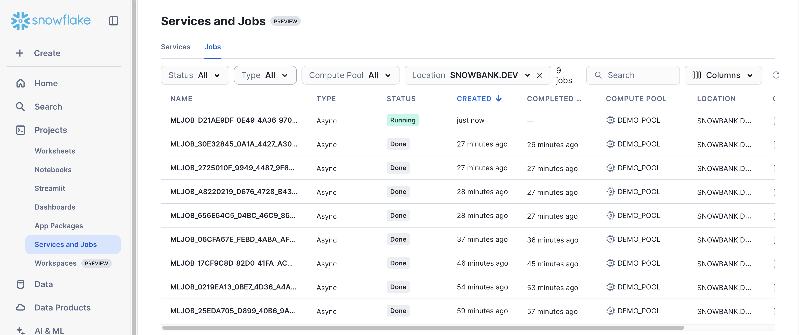
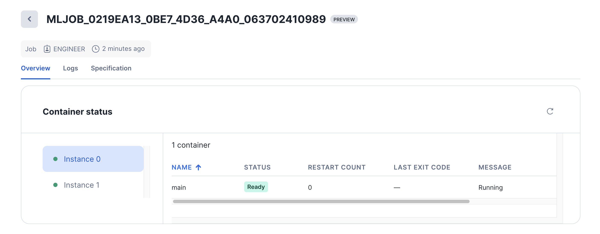

# ML Jobs

[Snowflake ML Jobs](https://docs.snowflake.com/developer-guide/snowflake-ml/ml-jobs/overview)
enable you to run machine learning workloads inside Snowflake
[ML Container Runtimes](https://docs.snowflake.com/en/developer-guide/snowflake-ml/container-runtime-ml)
from any environment. This solution allows you to:

- Leverage GPU and high-memory CPU instances for resource-intensive tasks
- Use your preferred development environment (VS Code, external notebooks, etc.)
- Maintain flexibility with custom dependencies and packages
- Scale workloads across multiple nodes effortlessly

Whether you're looking to productionize your ML workflows or prefer working in
your own development environment, Snowflake ML Jobs provides the same powerful
capabilities available in Snowflake Notebooks in a more flexible,
integration-friendly format.

See the [Examples](#examples) section to find end-to-end examples of using ML Jobs.

## Setup

The Runtime Job API (`snowflake.ml.jobs`) API is available in
`snowflake-ml-python>=1.26.0`.

```bash
pip install snowflake-ml-python>=1.26.0
```

> NOTE: As of `snowflake-ml-python` 1.23.0, ML Jobs support Python 3.10, 3.11,
> and 3.12. Jobs automatically select a runtime environment matching the client
> Python version.
>
> Some advanced distributed examples in [`distributed_training`](./distributed_training)
> use direct per-instance execution and require `snowflake-ml-python>=1.54.0`.

## Getting Started

### Prerequisites

Create a compute pool if you don't already have one ready to use.

```sql
CREATE COMPUTE POOL IF NOT EXISTS DEMO_POOL_CPU -- Customize as desired
    MIN_NODES = 1
    MAX_NODES = 1               -- Increase if more concurrency desired
    INSTANCE_FAMILY = CPU_X64_S -- See https://docs.snowflake.com/en/sql-reference/sql/create-compute-pool
```

Your account must have at least one image repository created in order to use Snowflake
container images. See [Known Limitations](#known-limitations) for more information.

### Function Dispatch

Python functions can be executed as Runtime Jobs using the `snowflake.ml.jobs.remote`
decorator.

```python
from snowflake.ml.jobs import remote

compute_pool = "MY_COMPUTE_POOL"
@remote(compute_pool, stage_name="payload_stage")
def hello_world(name: str = "world"):
    # We recommend importing any needed modules *inside* the function definition
    from datetime import datetime

    print(f"{datetime.now()} Hello {name}!")

# Function invocation returns a job handle (snowflake.ml.jobs.MLJob)
job = hello_world("developer")

print(job.id)               # Jobs are given unique IDs
print(job.status)           # Check job status
print(job.get_logs())       # Check job's console logs
print(job.wait(timeout=10)) # Block until job completion with optional timeout
```

> NOTE: Compute pool startup can take several minutes and can cause job execution
  to be delayed; subsequent job executions should start much faster.
  Consider manually starting the compute pool using
  `ALTER COMPUTE POOL <POOL_NAME> RESUME` prior to job execution.

### File-based Dispatch

The API also supports submitting entire Python files for execution for more
flexibility.

```python
# /path/to/repo/my_script.py

def main(*args):
    print("Hello world", *args)

if __name__ == '__main__':
    import sys
    main(*sys.argv[1:])
```

```python
from snowflake.ml.jobs import submit_file, submit_directory, submit_from_stage

compute_pool = "MY_COMPUTE_POOL"

# Upload and run a single script
job1 = submit_file(
    "/path/to/repo/my_script.py",
    compute_pool,
    stage_name="payload_stage",
    args=["arg1", "--arg2_key", "arg2_value"],  # (Optional) args are passed to script as-is
)

# Upload an entire directory and run a contained entrypoint
# This is useful if your code is organized into multiple modules/files
job2 = submit_directory(
    "/path/to/repo/",
    compute_pool,
    entrypoint="my_script.py",
    stage_name="payload_stage",
    args=["arg1", "arg2"],  # (Optional) args are passed to script as-is
)

# Submit a job from an existing stage and run its contained entrypoint.
# This is useful if your code is stored in a Snowflake stage or Git repository.
job3 = submit_from_stage(
    "@test_stage/path/to/repo/",
    compute_pool,
    entrypoint="@test_stage/path/to/repo/my_script.py", 
    stage_name="payload_stage",
    args=["arg1", "arg2"],  # (Optional) args are passed to script as-is
)

# Entrypoint may also be a relative path
job4 = submit_from_stage(
    "@test_stage/path/to/repo/",
    compute_pool,
    entrypoint="my_script.py", # Resolves to @source_stage/ml_project/train.py
    stage_name="payload_stage",
    args=["arg1", "arg2"],  # (Optional) args are passed to script as-is
)

```

`job1`, `job2` and `job3` are job handles, see [Function Dispatch](#function-dispatch)
for usage examples.

### Job definition

A job definition captures the reusable parts of an ML Job—payload location, compute pool, and other configuration—while keeping
arguments separate. This lets you create multiple jobs from the same payload with different arguments, without re-uploading the
payload. Defining a job is very similar to creating a job.

```python
from snowflake.ml.jobs import remote

compute_pool = "MY_COMPUTE_POOL"
@remote(compute_pool, stage_name="payload_stage")
def hello_world(name: str = "world"):
    from datetime import datetime

    print(f"{datetime.now()} Hello {name}!")

# this is a definition handle
definition = hello_world

job1 = hello_world()

job2 = hello_world(name="ML Job Definition")
```

```python
# Another way to create a job: first register a job definition, then use it to create jobs
from snowflake.ml.jobs import MLJobDefinition

job_definition = MLJobDefinition.register(
    "/path/to/repo/my_script.py",
    # If you register a source directory, provide the entrypoint file:
    # entrypoint="/path/to/repo/my_script.py",
    compute_pool=compute_pool,
    stage_name="payload_stage",
)
# Arguments follow the same format used in file dispatch
job1 = job_definition("arg1", "--arg2_key", "arg2_value")

job2 = job_definition("arg3", "--arg4_key", "arg4_value")

```

### Task Integration

ML Job definitions integrate directly with the Task SDK. Use a definition as the task definition when creating a DAG task.
For a detailed example, see `e2e_task_graph/README.md`.

```python
@remote(COMPUTE_POOL, stage_name=JOB_STAGE, target_instances=2)
def train_model(input_data: DataSource) -> Optional[str]:
    ...

train_model_task = DAGTask("TRAIN_MODEL", definition=train_model)
```


### Supporting Additional Payloads in Submissions

When submitting a file, directory, or from a stage, use the `imports` argument to declare additional
dependencies such as ZIP files and Python modules. The import path can be specified explicitly;
otherwise, it is inferred from the location of the additional payload.

Local directories and Python files are automatically compressed, and their internal layout is
determined by the specified import path. The import path applies only to local directories,
Python files, and staged Python files. When referencing files in a stage, only individual files
are supported, not directories.

> Note: The `additional_payloads` argument is deprecated. Use `imports` instead.

```python
from snowflake.ml.jobs import submit_file, submit_directory, submit_from_stage

job1 = submit_file(
    "/path/to/repo/my_script.py",
    compute_pool,
    stage_name="payload_stage",
    args=["arg1", "--arg2_key", "arg2_value"],
    imports=[
      ("src/utils/", "utils"), # The import path is utils
    ],
)


job2 = submit_directory(
    "/path/to/repo/",
    compute_pool,
    entrypoint="my_script.py",
    stage_name="payload_stage",
    args=["arg1", "arg2"],
    imports=[
      ("src/utils/"), # The import path is utils
    ],
)

job3 = submit_from_stage(
    "@test_stage/path/to/repo/",
    compute_pool,
    entrypoint="@test_stage/path/to/repo/my_script.py",
    stage_name="payload_stage",
    args=["arg1", "arg2"],
    imports=[
      ("@source_stage/src/utils.py", "utils"), # Stage imports must be individual files
    ],
)
```

### Accessing Snowflake from an ML Job

ML Jobs are automatically configured with a Snowpark Session in the job context. 

Snowpark Sessions can be passed into an ML Job as an argument using the `snowflake.ml.jobs.remote` decorator.
> Note: The session argument must either be required or default to None;  Passing a default session instance (e.g., `session=session) is not supported.

```python
from snowflake.ml.jobs import remote
from snowflake.snowpark import Session

@remote("MY_COMPUTE_POOL", stage_name="payload_stage")
def hello_world(session: Session, name: str = "world"):
    # We recommend importing any needed modules *inside* the function definition
    from datetime import datetime
    if session:
        print(f"current database: {session.get_current_database()}")
    print(f"{datetime.now()} Hello {name}!")
```

You can also retrieve the Session instance with the following code:

```python
# From inside the job payload
from snowflake.snowpark import Session
session = Session.builder.getOrCreate()

# Equivalent alternative
from snowflake.snowpark.context import get_active_session
session = get_active_session()
```

Note this should be run from *inside* the ML Job payload, i.e.

```python
@remote("MY_COMPUTE_POOL", stage_name="MY_PAYLOAD_STAGE")
def my_ml_job():
    from snowflake.snowpark import Session
    session = Session.builder.getOrCreate()
    ...
```

### Retrieving Results

You can retrieve the job execution result using the `MLJob.result()` API.
The API returns the payload's return value or, if execution failed, raises an exception.

> NOTE: File-based jobs may use a special `__return__` variable to return the execution result, 
otherwise the `.result()` will be `None` on success. See [File-based Dispatch](#file-based-dispatch) for more details.

#### Function Dispatch

```python
from snowflake.ml.jobs import get_job

job = get_job('MLJOB_00000000_0000_0000_0000_000000000000')

# Blocks until job completion and returns the execution result on success
# or raises an exception on failure
result = job.result()
```

#### File-based Dispatch

```python
# /path/to/repo/my_script.py
def main() -> str:
    return "Hello world"

if __name__ == "__main__":
    __return__ = main()
```

```python
from snowflake.ml.jobs import submit_file, submit_directory, submit_from_stage

# Upload and run a single script
job = submit_file(
    "/path/to/repo/my_script.py",
    "MY_COMPUTE_POOL",
    stage_name="payload_stage",
)

result = job.result() # Hello world
```

### List Jobs

You can retrieve the jobs using the `jobs.list_jobs()` API.
The API returns a pandas DataFrames containing name, status, message, database_name, schema_name, owner, compute_pool, target_instances, created_time, completed_time
or, if execution failed, raises an exception.

```python
from snowflake.ml.jobs import list_jobs
list_jobs()
# columns: name, status, message, database_name, schema_name, owner, compute_pool, target_instances, created_time, completed_time
```

### Job UI in Snowsight

You can monitor current and previous ML Job executions via the new Job UI in Snowsight.
This provides a centralized view of all your jobs with real-time status updates and detailed execution information.

**Job List View**: Navigate to **Projects** > **Services and Jobs** > **Jobs** to see all your running and completed jobs:



**Job Overview**: Click on any job to see detailed information including container status, logs, and execution metrics:



The Job UI makes it easy to:
- Monitor job progress and status
- View detailed logs and error messages
- Track resource usage and performance metrics
- Access job specifications and configuration details

## Advanced Usage

### Specifying a Container Runtime

The `@remote` decorator, as well as `submit_file`, `submit_directory`, and
`submit_from_stage`, support the `runtime_environment` keyword. When you omit it,
Snowflake uses the latest available Snowflake Container Runtime on your compute pool.

To pin a specific Container Runtime version, pass the version string (for example, `2.3.0`).
See [Container Runtime releases](https://docs.snowflake.com/en/developer-guide/snowflake-ml/container-runtime/releases)
for available versions and default packages.

```python
from snowflake.ml.jobs import remote, submit_file

@remote(
    compute_pool,
    stage_name="payload_stage",
    runtime_environment="2.3.0",
)
def train_model():
    ...

job = submit_file(
    "/path/to/repo/my_script.py",
    compute_pool,
    stage_name="payload_stage",
    runtime_environment="2.3.0",
)
```

### Custom Python Dependencies

The Runtime Job API runs payloads inside the Snowflake
[Container Runtime for ML](https://docs.snowflake.com/en/developer-guide/snowflake-ml/container-runtime-ml)
environment which comes pre-installed with most commonly used Python packages
for machine learning and data science. Most use cases should work "out of the box"
with no additional Python packages needed. If custom dependencies are required,
the API supports specifying `pip_requirements` which will be installed on runtime
startup.

Installing packages to the runtime environment requires an
[External Access Integration](https://docs.snowflake.com/en/developer-guide/external-network-access/creating-using-external-network-access)

```sql
-- Requires ACCOUNTADMIN
-- Snowflake provides a pre-configured network rule for PyPI access
CREATE OR REPLACE EXTERNAL ACCESS INTEGRATION PYPI_EAI
    ALLOWED_NETWORK_RULES = (snowflake.external_access.pypi_rule)
    ENABLED = true;
GRANT USAGE ON INTEGRATION PYPI_EAI TO ROLE <role_name>;
```

```python
from snowflake.ml.jobs import remote, submit_file, submit_directory

compute_pool = "MY_COMPUTE_POOL"

# Example only; numpy is already installed in the runtime environment by default
@remote(
    compute_pool,
    stage_name="payload_stage",
    pip_requirements=["numpy"],
    external_access_integrations=["pypi_eai"],
)
def hello_world(name: str = "world"):
    # We recommend importing any needed modules *inside* the function definition
    from datetime import datetime

    print(f"{datetime.now()} Hello {name}!")

job1 = hello_world("developer")

# Can use standard pip/requirements syntax to specify versions
job2 = submit_file(
    "/path/to/repo/my_script.py",
    compute_pool,
    stage_name="payload_stage",
    pip_requirements=["numpy==2.2.*"],
    external_access_integrations=["pypi_eai"],
)

# Can provide PIP_INDEX_URL to install packages from private source(s)
job3 = submit_directory(
    "/path/to/repo/",
    compute_pool,
    entrypoint="my_script.py",
    stage_name="payload_stage",
    pip_requirements=["custom-package"],
    external_access_integrations=["custom_feed_eai"],  # Configure EAI as needed
    env_vars={'PIP_INDEX_URL': 'https://my-private-pypi-server.com/simple'},
)
```

### Multi-Node Capabilities

ML Jobs also support running distributed machine learning workloads across [multiple nodes](https://docs.snowflake.com/en/developer-guide/snowflake-ml/ml-jobs/distributed-ml-jobs).

Common execution patterns include:

- Head/worker frameworks such as [Ray](https://docs.ray.io/en/latest/ray-overview/examples.html) and distributor-based trainers
- Direct per-instance execution for repositories that already manage their own launcher, rendezvous, or multi-role topology

Both patterns let you scale workloads across multiple compute instances, process larger datasets, and speed up training through parallelization.

For head/worker frameworks such as Ray, specify the `target_instances` parameter:

```python
@remote(compute_pool, stage_name="payload_stage", target_instances=3)
def my_distributed_function():
    # Your distributed code here
    # Access instance-specific details via Ray
    import ray
    ray.init(address='auto', ignore_reinit_error=True)
    print(f"Ray nodes: {ray.nodes()}")
```

For user-owned launchers such as `torchrun`, DeepSpeed, `mpirun`, or multi-role application dispatchers, ML Jobs can also execute the same entrypoint on every allocated instance by setting `parallel=True`:

```python
from snowflake.ml.jobs import submit_directory

job = submit_directory(
    "/path/to/repo/",
    compute_pool,
    entrypoint=["bash", "launch.sh"],
    stage_name="payload_stage",
    target_instances=2,
    min_instances=2,
    parallel=True,
)

result = job.distributed_result()
print(result.exit_codes)
```

In this mode, each instance receives a consistent topology through environment variables such as `SNOWFLAKE_JOB_INDEX`, `SNOWFLAKE_JOBS_COUNT`, `MLRS_HEAD_IP`, `MLRS_NODE_IPS`, and `MLRS_RDZV_PORT`. See [`distributed_training`](./distributed_training) for end-to-end examples that adapt native PyTorch DDP, DeepSpeed ZeRO-3, Open MPI, and a multi-role PrimeRL workflow to that contract.

For multi-node jobs, you can access logs from individual instances:

```python
# Get logs from specific instances
job.get_logs()  # Instance 0
job.get_logs(instance_id=1)  # Node 1
job.get_logs(instance_id=2)  # Node 2
```

## Examples

### IDE

Examples showcasing how ML Jobs can be used from an IDE such as VSCode, Cursor, or PyCharm.

- [xgb_classifier](./xgb_classifier) - train a simple XGBoost classifier
- [pytorch_image_classifier](./pytorch_image_classifier) - train a simple PyTorch model for CIFAR-10
  image classification. Also demonstrates integration with Weights and Biases for experiment tracking
- [distributed_xgb_classifier](./distributed_xgb_classifier) - train an XGBoost model using the [Snowflake Container Runtime's distributor APIs](https://docs.snowflake.com/en/developer-guide/snowflake-ml/container-runtime-ml#xgboost)
  for distributed training across multiple nodes 
- [distributed_training](./distributed_training) - run user-owned distributed launchers directly on every ML Job instance, including PyTorch DDP, DeepSpeed ZeRO-3, Open MPI, and a multi-role PrimeRL workflow

### Jupyter Notebooks

Examples showcasing how ML Jobs can be used from a notebook environment like Jupyter.

- [xgb_classifier_nb](./xgb_classifier_nb) - train a simple XGBoost classifier
- [distributed_xgb_classifier_nb](./distributed_xgb_classifier_nb) - train an XGBoost model using the [Snowflake Container Runtime's distributor APIs](https://docs.snowflake.com/en/developer-guide/snowflake-ml/container-runtime-ml#xgboost)
  for distributed training across multiple nodes 

### Pipelines / DAGs

Examples showcasing how ML Jobs can be integrated with workflow/DAG frameworks like Snowflake Task Graphs and Apache Airflow.

- [e2e_task_graph](./e2e_task_graph/) - end-to-end feature engineering and modeling pipeline using Snowflake Task Graph
- [xgb_classifier_airflow](./xgb_classifier_airflow/) - orchestrate model training and evaluation using Apache Airflow

### LLM Fine-Tuning

Examples showcasing LLM post-training with ML Jobs.

- [llm_finetune](./llm_finetune) - supervised fine-tuning of Qwen3-1.7B with ArcticTraining (including LoRA)
- [rl_finetuning](./rl_finetuning) - GRPO reinforcement learning recipes for medical SOAP notes with AReaL

## Known Limitations

1. Job submission may fail with `Failed to retrieve image <image_name> from the image repository`
if your account has not been properly configured with image registries yet.
This can be resolved by [creating an image repository](https://docs.snowflake.com/en/sql-reference/sql/create-image-repository)
anywhere in your account.
1. Job logs may be subject to delays and may not be immediately available if compute pool has been suspended or the job entity itself has been deleted
1. ML Jobs are automatically cleaned up after a time-to-live (TTL) of 7 days. However, job payload stages (configured via the `stage_name` parameter) are not automatically cleaned up. Please manually clean up using either the `delete_job()` API or SQL commands. While the job itself will be deleted automatically after TTL, the associated stages still require manual cleanup.
    
    ```sql
    REMOVE <stage_path>
    ```
    
    ```python
    from snowflake.ml.jobs import list_jobs, delete_job
    for _, row in list_jobs(limit=-1).iterrows():
      if row["status"] in {"DONE", "FAILED"}:
        delete_job(row["name"])
    ```
