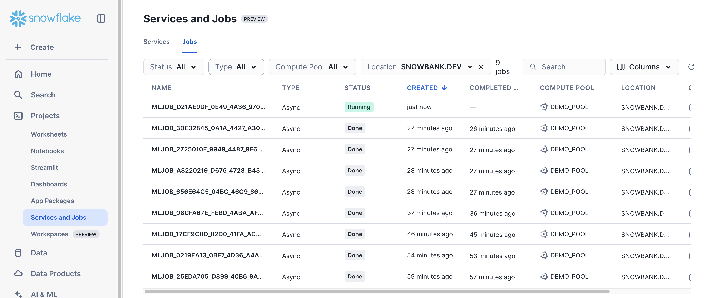
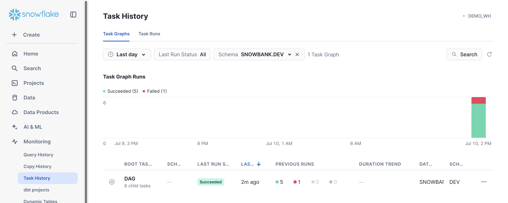
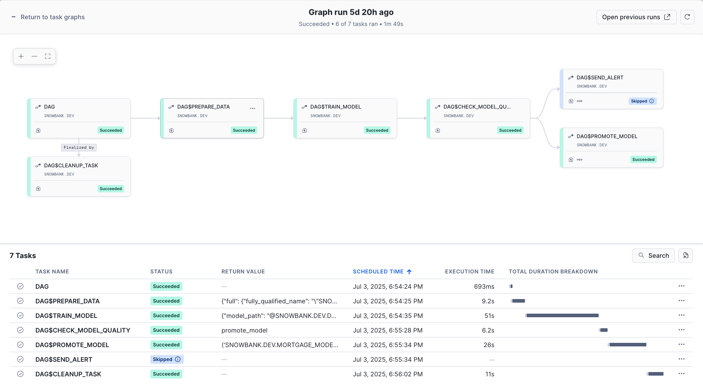

# End-to-End ML Pipeline with Snowflake Task Graphs

This example demonstrates how to build a complete machine learning pipeline using [Snowflake ML Jobs](https://docs.snowflake.com/developer-guide/snowflake-ml/ml-jobs/overview)
and [Snowflake Task Graphs](https://docs.snowflake.com/en/developer-guide/snowflake-python-api/snowflake-python-managing-tasks).
The pipeline includes data preparation, model training, evaluation, conditional promotion, and cleanup — all automated and scheduled using a Task Graph.

## Prerequisites

### Snowflake Account Setup

Work with your account administrator to provision the required resources in your Snowflake account as needed.

> NOTE: The steps below use role name `ENGINEER`. Replace this with the role name you will be using to
  work through the example.

1. Create a compute pool if you don't already have one:

```sql
CREATE COMPUTE POOL IF NOT EXISTS DEMO_POOL
    MIN_NODES = 1
    MAX_NODES = 2
    INSTANCE_FAMILY = CPU_X64_S;
GRANT USAGE ON COMPUTE POOL TO ROLE ENGINEER;
```

Note: `MAX_NODES` should be at least equal to `target_instances` (2 in this example).

2. Create a virtual warehouse if you don't already have one:

```sql
CREATE WAREHOUSE IF NOT EXISTS DEMO_WH;  -- Default settings are fine
GRANT USAGE ON WAREHOUSE DEMO_WH TO ROLE ENGINEER;
```

3. Configure database privileges for the demo. Subsequent steps will create resources inside this database.

```sql
-- OPTIONAL: Create a separate database for easy cleanup
CREATE DATABASE IF NOT EXISTS SNOWBANK;

GRANT USAGE ON DATABASE SNOWBANK TO ROLE ENGINEER;
GRANT CREATE SCHEMA ON DATABASE SNOWBANK TO ROLE ENGINEER;
```

4. Grant other required [access control privileges](https://docs.snowflake.com/en/user-guide/security-access-control-privileges)
  needed to execute the sample:

```sql
EXECUTE TASK ON ACCOUNT TO ROLE ENGINEER;
```

5. (Optional) Configure a [notification integration](https://docs.snowflake.com/en/user-guide/notifications/webhook-notifications)
  to enable [sending notifications](https://docs.snowflake.com/en/user-guide/notifications/snowflake-notifications)
  from Task Graph executions.
    1. Option 1: Email notifications
        1. [Verify the email addresses](https://docs.snowflake.com/en/user-guide/notifications/email-notifications#label-email-notification-verify-address)
            of intended notification recipients
        2. [Create the email notification integration](https://docs.snowflake.com/en/user-guide/notifications/email-notifications#label-create-email-notification-integration)
            ```sql
            SET user_email = (SELECT EMAIL FROM SNOWFLAKE.ACCOUNT_USAGE.USERS WHERE NAME = CURRENT_USER());
            CREATE OR REPLACE NOTIFICATION INTEGRATION DEMO_NOTIFICATION_INTEGRATION
                TYPE=EMAIL
                DEFAULT_RECIPIENTS = ($user_email)
                DEFAULT_SUBJECT = 'Model Training Status'
                ENABLED=TRUE;
            GRANT USAGE ON INTEGRATION DEMO_NOTIFICATION_INTEGRATION TO ROLE ENGINEER;
            ```
    2. Option 2: Webhook notifications (e.g. Slack, Teams)
        1. Create a webhook with your desired notification channel (e.g. [Slack Webhook](https://api.slack.com/messaging/webhooks))
        2. Configure notification integration with your webhook
            ```sql
            CREATE SECRET IF NOT EXISTS DEMO_WEBHOOK_SECRET
                TYPE = GENERIC_STRING
                SECRET_STRING = 'T00000000/B00000000/XXXXXXXXXXXXXXXXXXXXXXXX'; -- (ACTION NEEDED) Put your webhook secret here
            CREATE OR REPLACE NOTIFICATION INTEGRATION DEMO_NOTIFICATION_INTEGRATION
                TYPE=WEBHOOK
                ENABLED=TRUE
                WEBHOOK_URL='https://hooks.slack.com/services/SNOWFLAKE_WEBHOOK_SECRET'
                WEBHOOK_SECRET=DEMO_WEBHOOK_SECRET
                WEBHOOK_BODY_TEMPLATE='{"text": "SNOWFLAKE_WEBHOOK_MESSAGE"}'
                WEBHOOK_HEADERS=('Content-Type'='application/json');
            GRANT USAGE ON INTEGRATION DEMO_NOTIFICATION_INTEGRATION TO ROLE ENGINEER;
            ```

### Local Setup

1. All steps assume your working directory is the `e2e_task_graph/` folder

    ```bash
    cd samples/ml/ml_jobs/e2e_task_graph
    ```

2. Configure your default Snowflake connection following the [connection configuration guide](https://docs.snowflake.com/developer-guide/snowflake-cli/connecting/configure-connections#define-connections)
3. Set up your development environments using the [setup_env.sh](scripts/setup_env.sh) helper script.
    The script will create a new virtual environment (if needed), install all the necessary Python packages,
    and create the necessary resources in your default Snowflake account from step 2.

    ```bash
    bash scripts/setup_env.sh -r ENGINEER  # Change ENGINEER to your role name
    ```

    > Modify `-r ENGINEER` to match the role name used in [Snowflake Account Setup](#snowflake-account-setup)

4. Update the values in [constants.py](src/constants.py) to match your Snowflake environment as configured
    in [Snowflake Account Setup](#snowflake-account-setup) and any modifications made to step 3 above.

## How to Run

### Standalone Pipeline (Local Testing)

[pipeline_local.py](src/pipeline_local.py) provides the core ML pipeline and can be executed locally
for testing purposes.
The pipeline reads features from a [Feature Store](https://docs.snowflake.com/en/developer-guide/snowflake-ml/feature-store/overview)
prepared in the previous [setup step](#local-setup), generates train and test data splits,
and runs model training using an ML Job. The pipeline concludes by evaluating the trained model and
conditionally logging the trained model to [Model Registry](https://docs.snowflake.com/en/developer-guide/snowflake-ml/model-registry/overview)
for downstream consumption.

Run the ML pipeline locally without task graph orchestration:

```bash
python src/pipeline_local.py
python src/pipeline_local.py --no-register  # Skip model registration for faster experimentation
```

You can monitor the corresponding ML Job for model training via the [Job UI in Snowsight](../README.md#job-ui-in-snowsight).



### Task Graph Orchestration

[pipeline_dag.py](src/pipeline_dag.py) contains the Task Graph definition and can be used to trigger
[one-off executions](#one-time-execution) or [scheduled runs](#scheduled-execution).

#### One-Time Execution

Deploy and immediately execute the task graph:

```bash
python src/pipeline_dag.py --run-dag
```

The script will:
- Deploy the task graph to Snowflake
- Execute it immediately
- Monitor execution progress
- Display the final status

#### Scheduled Execution

Deploy the task graph with a recurring schedule:

```bash
python src/pipeline_dag.py --schedule 1d   # Daily execution
python src/pipeline_dag.py --schedule 12h  # Every 12 hours
python src/pipeline_dag.py --schedule 30m  # Every 30 minutes
```

### Task Graph UI in Snowsight

Once your Task Graph is deployed and running, you can monitor and inspect your DAG executions through Snowflake's Task Graph UI in Snowsight.

Navigate to **Monitoring** > **Task History** to access the Task Graph interface:



Click into the Task Graph of interest to get a detailed view of the latest execution for that graph.
In this case, click on **DAG** to inspect the Task Graph created in [pipeline_dag.py](src/pipeline_dag.py)



This visual interface makes it easy to:
- Validate that task execution is proceeding as expected
- Debug failed executions by examining task logs and dependencies
- Verify that conditional logic (like model promotion) is working correctly


## Key Features

### Task Graph Orchestration

[pipeline_dag.py](src/pipeline_dag.py) leverages several key [Snowflake Task Graph](https://docs.snowflake.com/en/developer-guide/snowflake-python-api/snowflake-python-managing-tasks) features:

- **DAG Creation**: Using `DAG` context manager to define workflow structure
- **Task Dependencies**: Using `>>` operator to define execution order
- **Task Context**: Passing values between Tasks in the DAG via the `TaskContext`
- **Branching Logic**: Using `DAGTaskBranch` for conditional execution paths
- **Finalizer Tasks**: Ensuring cleanup always runs regardless of success/failure

### Model Training on SPCS using ML Jobs

The `train_model` function uses the `@remote` decorator to run multi-node training on Snowpark Container Services:

```python
@remote(COMPUTE_POOL, stage_name=JOB_STAGE, target_instances=2)
def train_model(session: Session, input_data: DataSource) -> XGBClassifier:
    # Training logic runs on distributed compute
```

### Conditional Model Promotion

The task graph includes branching logic that only promotes models meeting quality thresholds:

```python
def check_model_quality(session: Session) -> str:
    if metrics[config.metric_name] >= threshold:
        return "promote_model"  # High quality → promote
    else:
        return "send_alert"     # Low quality → alert
```

### Model Registry Integration
Successful models are automatically registered and promoted to production:

```python
mv = register_model(session, model, model_name, version, train_ds, metrics)
promote_model(session, mv)  # Sets as default version
```
