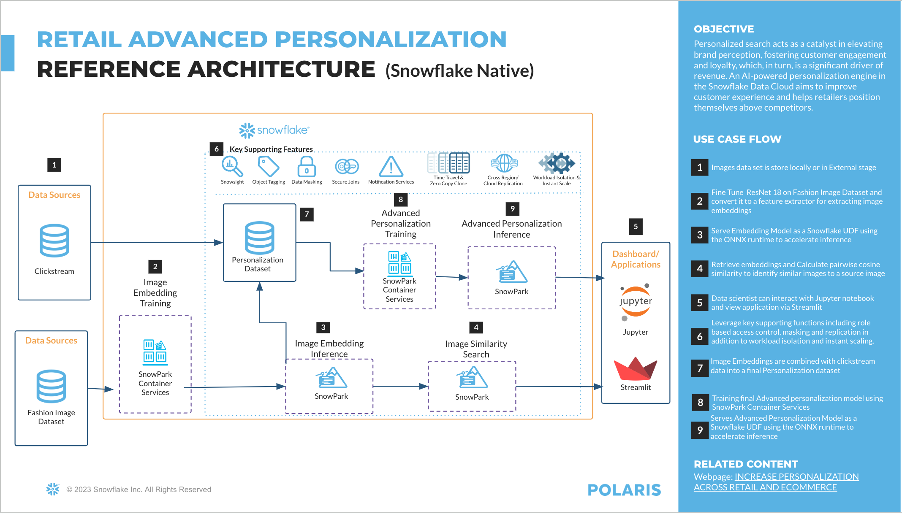

# Retail Fashion
Industry solution asset for Retail Fashion data cloud. 

## Use Case Summary
Retailers use recommendation systems to advertise their products to customers in order to personalize customer experience online and at their stores. Doing so allows retailers to raise awareness to customers of products that match their style and tastes increasing number of items in their cart and the chances of a sale.

It is important to note that when creating these recommendations, we are not only taking into consideration the images of the product we are advertising, but also the customer's profile and their behavior online as well. Using all 3 of those data sources, we can create a truly personalized recommendation model that recommends different products to different customers. 

### Storyline:
The Retailer preprocesses the product image data through cropping, resizing, and other formatting processes. Using a pretrained image classification model (RESNET18), they use transfer learning in order to retrain the model on their image data, predicting classes specific to their product and store the model in Snowflake's staging area within Snowflake's cloud. They then create a UDF (User Defined Function) to perform downstream tasks to turn the images into image embeddings by retrieving the second to last layer in their deep learning model during these downstream tasks that are then encoded and stored in a datatable in Snowflake's database. 
The dimensions of the image data themselves are not interpretable or specific to any particular feature of the image. But the images that are similar in cosine similarity distances can be argued to be similar to each other in terms of visualizations. With these cosine similarity scores, the retailers can then create recommendations for similar products that our customers interact with.


## Solution Architecture 



## Setup


- install requirements once the conda env is activated:
```sh
    conda env update -n pysnowpark --file conda_pysnowpark_environment.yml
```

- configure snowflake_connection_template.json file with the appropriate snowflake conection
- create a Medium snowpark optimized WH called SNOWPARK_OPT_WH.
- Downloading data:
  - cd to Fashion repository
  - `conda activate pysnowpark`
  - make sure you installed `boto3`
  - change `download_dir` to local directory for download
  - `python data_raw.py` (Python 3.9 required)
- Downloading data models and clickstream data
  - https://sfquickstarts.s3.us-west-1.amazonaws.com/advanced_personalization_recommendation_engine/best_model.pt
  - https://sfquickstarts.s3.us-west-1.amazonaws.com/advanced_personalization_recommendation_engine/clickstream.csv
  - https://sfquickstarts.s3.us-west-1.amazonaws.com/advanced_personalization_recommendation_engine/optuna_model_debug.sav
- NOTE: If the raw data downloading is not working, delete the "data_raw" folder and try again.
- NOTE: S3 links downloads the clickstream data, image embedding model, and advanced personalization model. If you download them, you could deploy them into staging with a "PUT" statement rather than training and deploying the model for usage.
- Execute the different notebooks
  -  use a demo account, where you have some level of control
  -  the notebooks would create a seperate db, role etc..


